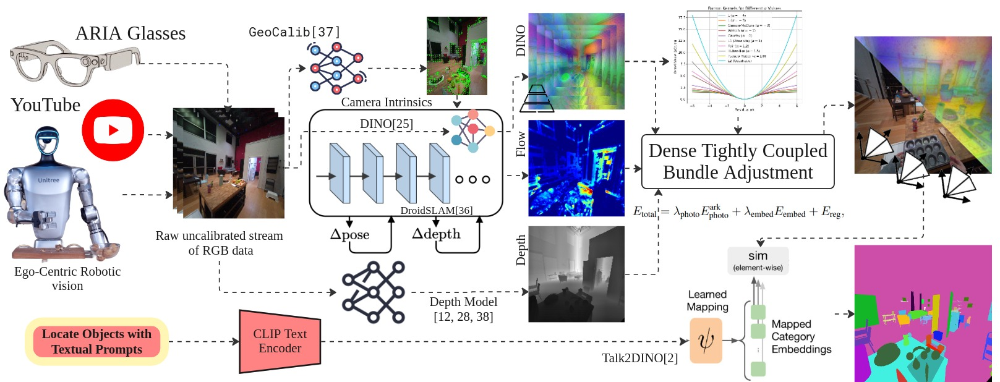

# KM-ViPE: Online Tightly Coupled Vision-Language-Geometry Fusion for Open-Vocabulary Semantic SLAM

**Contributors**: Be2R Lab (ITMO), SBER Robotics Center.




**Full Abstract**: We present KM-ViPE (**K**nowledge **M**apping **Vi**deo **P**ose **E**ngine), a real-time open-vocabulary SLAM framework for uncalibrated monocular cameras in dynamic environments. Unlike systems requiring depth sensors and offline calibration, KM-ViPE operates directly on raw RGB streams, making it ideal for ego-centric applications and harvesting internet-scale video data for training.
KM-ViPE tightly couples DINO visual features with geometric constraints through a high-level features based adaptive robust kernel that handles both moving objects and movable static objects (e.g., moving furniture in ego-centric views). The system performs simultaneous online localization and open-vocabulary semantic mapping by fusing geometric and deep visual features aligned with language embeddings.
Our results are competitive with state-of-the-art approaches, while existing solutions either operate offline, need depth data and/or odometry estimation, or lack dynamic scene robustness. KM-ViPE benefits from internet-scale training and uniquely combines online operation, uncalibrated monocular input, and robust handling of dynamic scenes, which makes it a good fit for autonomous robotics and AR/VR applications and advances practical spatial intelligence capabilities for embodied AI.


**[Arxiv](https://research.nvidia.com/labs/toronto-ai/vipe/assets/paper.pdf)**

## Installation
### Docker
```bash
# Build new docker image
make build

# Run docker image
make DATA_DIR={YOUR_DATA_DIR} run

# Inside docker
pip install --no-build-isolation -e .


## Usage

Example usages:

```bash
# Running the full pipeline.
python run.py pipeline=default streams=raw_mp4_stream streams.base_path=YOUR_VIDEO_OR_DIR_PATH

# Running the pose-only pipeline without depth estimation.
python run.py pipeline=default streams=raw_mp4_stream streams.base_path=YOUR_VIDEO_OR_DIR_PATH pipeline.post.depth_align_model=null
```


## Acknowledgments

ViPE is built on top of many great open-source research projects and codebases. Some of these include (not exhaustive):
- [ViPE](https://github.com/nv-tlabs/vipe?tab=readme-ov-file)
- [DINOv3](https://github.com/facebookresearch/dinov3)
- [Talk2DINO](https://github.com/lorebianchi98/Talk2DINO)
- [RVWO](https://github.com/be2rlab/rvwo)
- [UniDepth](https://github.com/lpiccinelli-eth/UniDepth)


## Citation

If you find KM-ViPE useful in your research or application, please consider citing the following paper:

```
@inproceedings{huang2025vipe,
    title={ViPE: Video Pose Engine for 3D Geometric Perception},
    author={Huang, Jiahui and Zhou, Qunjie and Rabeti, Hesam and Korovko, Aleksandr and Ling, Huan and Ren, Xuanchi and Shen, Tianchang and Gao, Jun and Slepichev, Dmitry and Lin, Chen-Hsuan and Ren, Jiawei and Xie, Kevin and Biswas, Joydeep and Leal-Taixe, Laura and Fidler, Sanja},
    booktitle={NVIDIA Research Whitepapers arXiv:2508.10934},
    year={2025}
}
```

## License

This project will download and install additional third-party **models and softwares**. Note that these models or softwares are not distributed by NVIDIA. Review the license terms of these models and projects before use. This source code is released under the [Apache 2 License](https://www.apache.org/licenses/LICENSE-2.0).
